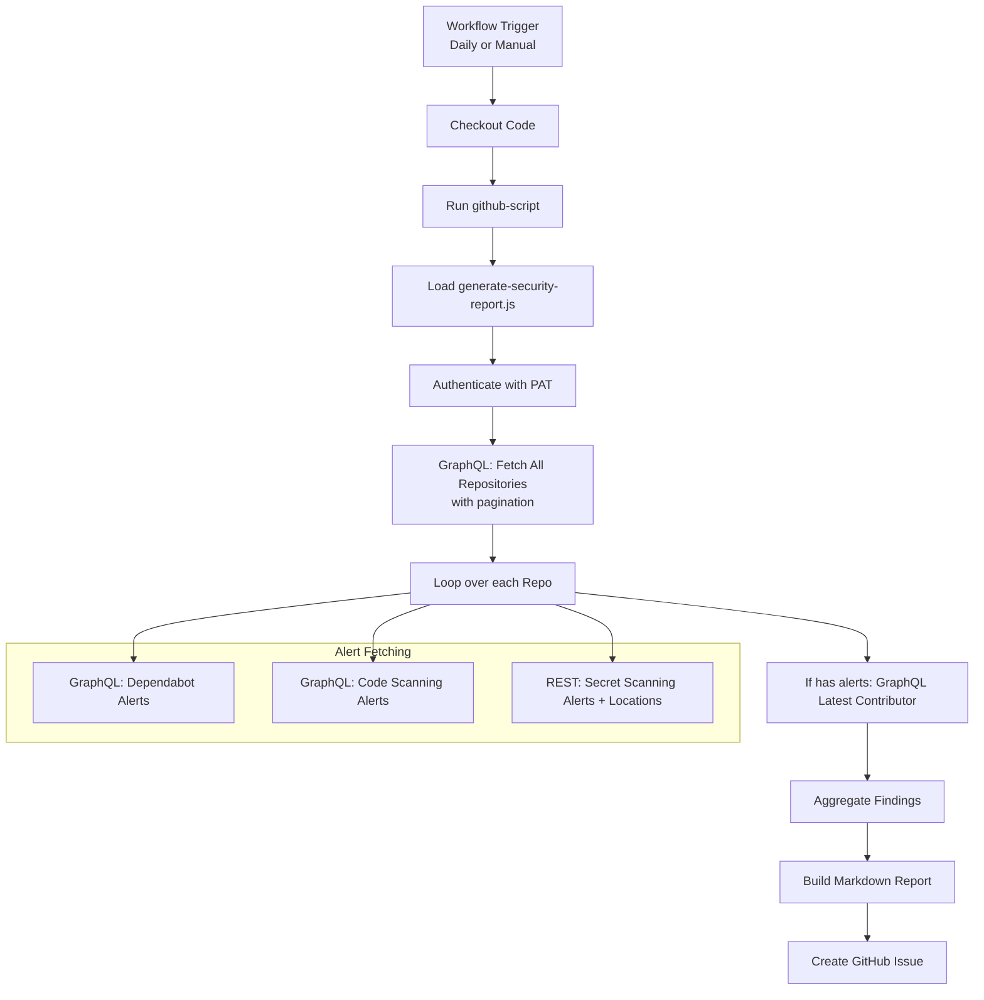

# GitHub Security Alerts Reporter - Design Document

## Overview

This project implements a daily automated security report for GitHub repositories using GitHub Actions. The goal is to provide a centralized, actionable daily summary of open security alerts across all accessible repositories.

## Objectives

- Minimize API rate limit consumption (GraphQL preference)
- Provide comprehensive visibility into Dependabot, Code Scanning, and Secret Scanning alerts
- Include context like latest contributor for accountability
- Generate human-readable Markdown issues for easy triage
- Be resilient and maintainable

## Architecture

### High-Level Flow

## API Strategy

| Component              | API Type   | Reason for Choice                  | Calls per Repo |
|------------------------|------------|------------------------------------|----------------|
| Repository List        | GraphQL    | Efficient pagination + affiliations| 1-2 total     |
| Dependabot Alerts      | GraphQL    | Native support                     | 1             |
| Code Scanning Alerts   | GraphQL    | Native support                     | 1             |
| Secret Scanning        | REST       | Best location/path support         | 1 + N         |
| Latest Contributor     | GraphQL    | Clean commit author data           | 1 (conditional)|

**Savings vs Pure REST**: ~50% fewer calls (see previous analysis).

## Key Design Decisions

1. **GraphQL-First**: Reduces round-trips and payload size.
2. **Conditional Contributor Fetch**: Only for repos with alerts.
3. **Error Resilience**: Per-repo try/catch so one bad repo doesn't stop the whole run.
4. **Issue-per-Day**: Clean history, easy to search/filter by label.
5. **Markdown-First Output**: Human and machine readable.

## Data Model (Findings)

Each finding includes:
- type, emoji, title, severity, path, created, link, extra

## Future Enhancements

- Batch more queries (GitHub GraphQL aliases)
- Add severity filtering
- Slack/Teams notification
- Auto-close resolved alerts
- Historical trend analysis

**Last Updated:** May 2026
